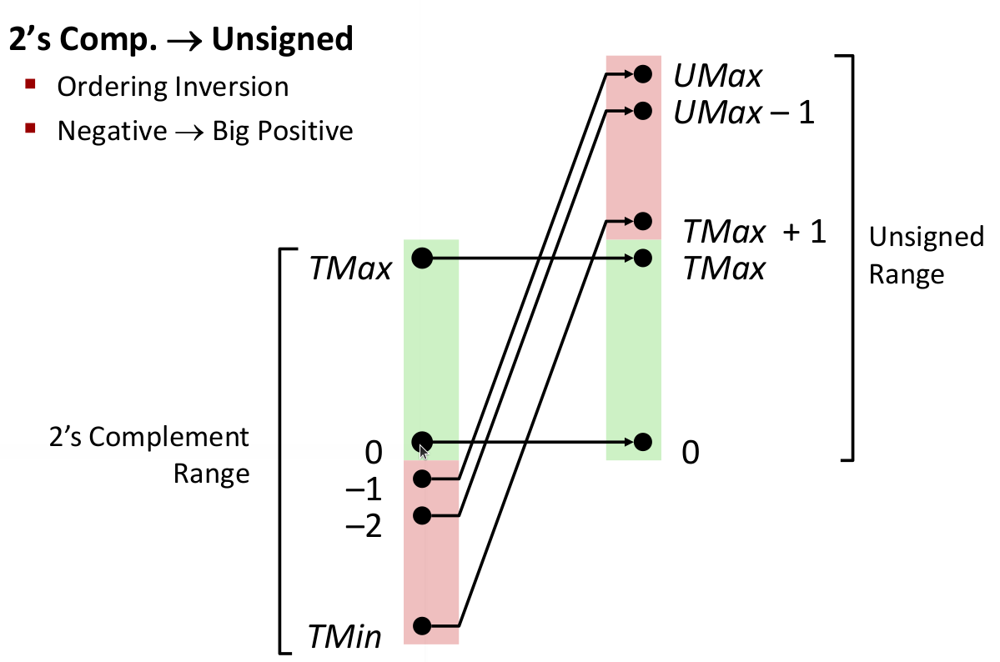
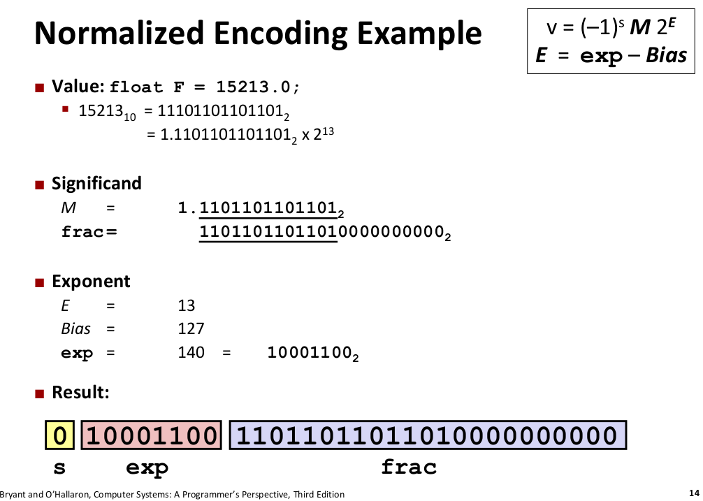

# references
1. https://github.com/Sorosliu1029/CSAPP-Labs
2. http://www.cs.cmu.edu/afs/cs/academic/class/15213-f17/www/

# Lec1-2 bits and bytes

| Type    | Byte(64bits machine) |
| ------- | -------------------- |
| char    | 1                    |
| short   | 2                    |
| int     | 4                    |
| long    | 8                    |
| float   | 4                    |
| double  | 8                    |
| pointer | 8                    |

## Bits level operation
1. Boolean Algebra: applied to integer type, &, ^, |, ~, yields an integer type
2. Logical Operator: &&, ||, !, early termination

## Integers
### Two's complement for Signed Int
$x_i=SignedBit*2^{w-1} + \sum_{i=0}^{w-2}x_i*2^i$
### Unsigned vs Signed 1byte=8bits
1. UMin-UMax: $[0, 2^w - 1]$      eg. uchar 0~255 [00000000, 11111111]
2. TMin-TMax: $[-2^{w-1}, 2^{w-1}-1]$   eg. char  -128~127 [10000000, 01111111]

### Conversion and Casting
1. Unsigned~Signed: Constant is signed by default, unless with a postfix U, eg 1234U
```cpp
char x=-128;
unsigned char y=1;
if(x<y){ // x: [10000000]2 [128]10
    printf("x<y");
}else{
    printf("x>=y"); //output x>=y because 128>1
}
```



2. Casting suprises: if there is an unsigned in the expression >, <, >=, <= etc, singed is converted into unsigned automatically.
   
### Expanding and Truncating
1. Expanding: unsigned pad zeros, signed pad signed bits, do not change value
2. Truncating: Discards the foremost bits, unsigned acts like mod operation, signed is the same unless the signed bit is discarded.
```
255 11111111
after truncting the first bit (255%128=127)
127  1111111
```

### Addition, Negation, Multiplication, Division
1. Pay attention to overflow and underflow

# Lec3 Floating Point
1. Single Precision: 32 bits
2. Double precision: 64 bits
3. Single Precision: 1 signed bit + 8 exponential bits + 23 fractional bits.


# Lec4 Machine Program
1. What's assembly language (asm)? It is the text format of binary opcode. eg, 0000 0011->ADD.
2. What does assembler do? It translate the text format assembly language into binary format. This process is called assembling.
3. Registers: 32-bits CPU, the register size is 32 bits. 64-bits CPU, the register size is 64 bits. 
4. Heap: the memory allocated/destroyed by the user manualy. malloc, new
5. Stack: automatically allocated when calling functions.
6. https://www.ruanyifeng.com/blog/2018/01/assembly-language-primer.html
   
## Simple Addressing Mode
1. Normal Addressing Mode: movq (%rcx), %rax, (R) Register R specifies memory address, pointer deferencing in C.
2. Displacement: movq 8(%rbp), %rdx

## Complete Memory Addressing Mode: D(Rb, Ri, S)==Mem[Reg[Rb] + S * Reg[Ri] + D]
1. D: constant displacement 1, 2, 4 bytes
2. Rb: base register, any of 16 integers
3. Ri: index register, any, except for %rsp
4. S: scale 1, 2, 4, 8


# Lec21 Netprogramming
1. Open Socket listenfd(server),  clientfd
2. Client request connect and server accept
3. DataExchangeLoop: Client write (send), Server read (receive), Server write (send), Client read (receive)
4. Close

# Lec24 Concurrent Programming
1. Process-based: fork() a process, no data sharing
2. Thread-based: share data, pay attention to which data to be shared, which not to be shared, otherwise result in 'race condition'


